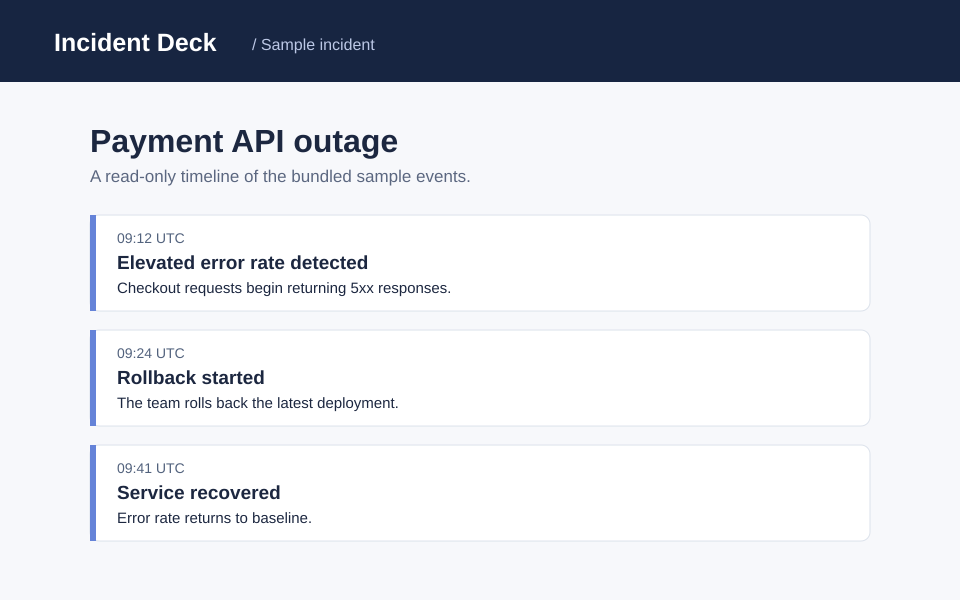

# Incident Deck


A powerful and seamless incident intelligence solution.

## Requirements

- Python 3
- A modern browser
- A terminal
- Internet access

## Installation

First clone the repository. Then set up your environment. If you use macOS, use your preferred shell. Windows users can use PowerShell. Linux users can use Bash. Install any missing tools before proceeding.

```sh
python3 -m http.server 8000
```

## Configuration

There are no configuration settings yet. The cloud dashboard and team sync will arrive soon.

## Features

- Incident timelines
- Collaboration
- Import your logs
- Root-cause analysis
- AI summaries

## Screenshot



## License

MIT
